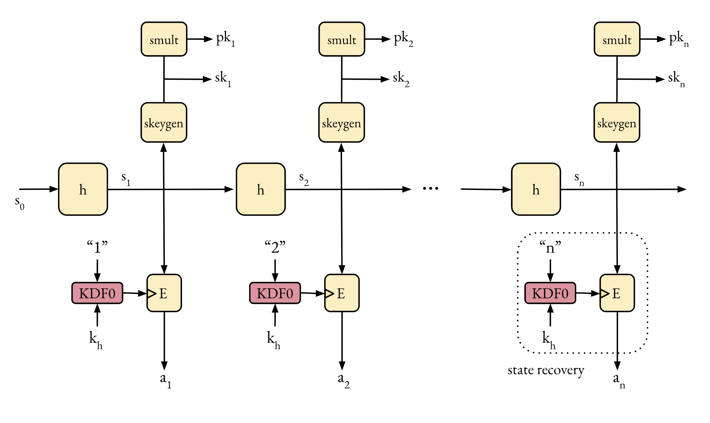

# _tile_: a time-locked encryption API ⏱🔐

_tile_ is a simple API for time-locked encryption (aka timed-release encryption).
_tile_ publishes X25519 public keys, and _also_ the corresponding private keys,
but only _after_ a predefined date in the future.


## API

_tile_ is very easy to use.
<details>
  <summary>Retrieve a public key</summary>
  
```Shell
curl -s \
     -d '{"reveal_not_before": "2020-08-21T18:25:43.511Z",
          "keyring_label": "2020-08-20_mushroom-paradox"}' \
     -H "Content-Type: application/json" \
     -X POST \
     https://tile-experimental.cryptographic.services:8082/v0/public_key \
     | jq
```

The parameters of the request are:
* `keyring_label`. See table below for possible values.
* `reveal_not_before`. An approximate time for disclosing the corresponding private key.


Typical successful response

```JSON
{
    "data": {
        "key_serial": 1598034600,
        "keyring_label": "2020-08-20_mushroom-paradox",
        "public_key": "bNhrEUObdoBbzeFsdb+W5bj/S6LwSr1nESb5b35wdWY=",
        "reveal_after": "2020-08-21T18:30:00+00:00Z"
    }
}
```

* The `public_key` field is the base64 representation of a X25519
public key, suitable for use with libsodium or NaCl.
* The `reveal_after` field is the "rounded up" version of the passed 
`reveal_not_before` parameter.
* The `key_serial` is an identifier that can be used to retrieve the
corresponding private key whenever is available.

The public keys are also available as a batch [in this folder](pk/).

</details>

<details>
  <summary>Retrieve a private key</summary>
  
```Shell
curl -s \
   -d '{"key_serial": "1598034600", "keyring_label":"2020-08-20_mushroom-paradox"}'  \
   -H "Content-Type: application/json" \
   -X POST \
   https://tile-experimental.cryptographic.services:8082/v0/private_key \
   | jq
```

Typical successful response:

```JSON
{
    "data": {
        "key_serial": 1598034600,
        "keyring_label": "2020-08-20_mushroom-paradox",
        "private_key": "Bd5ZOhlg5DRiKwXTK5fVnfYvlyy6MweSqcch1goZC7Q=",
        "reveal_after": "2020-08-21T18:30:00+00:00Z"
    }
}
```

If you ask for a key not yet revealed you'll get this response:

```JSON
{
    "error": {
        "code": "400",
        "message": "key not yet revealed"
    }
}
```

</details>

## Implementation

_tile_ is dead simple. The current version of tile
uses bread and butter crypto. Key storage and
private key computation happens on a small STM32 microcontroller
behind a data diode and without external access.
Meaning, it won't be easy for you to hack it from your couch!
The STM32 uses a GPS module to keep track of time.
A raspberry pi is used as a gateway to the wild internet.


### A bit more on data diodes

Data diodes are a very nice primitive. A data diode partitions the system
into two domains: trusted (A) and untrusted (B). Communication is one way
only (A to B). The data diode blocks any information flow from B to A.
This reduces (or even removes completely) the remote attack surface of the trusted domain.

Since the STM32 a) sits in the trusted domain b) runs known code and c) never sees
untrusted input (bar the GPS NMEA data), we can expect it'll behave as specified.
We can't say the same thing about the raspberry pi; however, it doesn't perform
any security sensitive operation. A compromised raspberry pi will affect availability
(please don't hack me), but secret key material will stay confidential.

The STM32 outputs keys via a 9600 baud serial interface without any flow
control. The data diode is placed on this line, and is implemented with
a H11L3 optocoupler. This optocoupler has the nice feature of having
a Schmitt trigger output. I put the optocoupler for the kicks - 
it's not really needed.

### Crypto bits

The uni-directional link slightly complicates the protocol if we want to make the system
resilient against packet loss. We assume the transport from the trusted domain to the 
untrusted one is unreliable, but still want to retroactively derive private keys emited
in the past (even if the main processor was offline at that time).
There's no return path, so acknowledgements will not make it to the trusted domain.



The first version used a hash chain of secret values `s_i = h(s_{i-1})`. The
X25519 keys pairs are generated from this chain as `sk_i = clamp(s_i)`.
Secret keys are released in reverse order: first `sk_{i+1}`, then `sk_i`, ...
An encrypted version of the chain is published as `a_i := E(KDF("i", k), s_i)`
(this is an encryption of `s_i` under a key `KDF("i", k)`),
so that the secure domain only has to emit `KDF("i", k_h)` periodically across
the data diode to "open" each chain element. The set of a_i is public auxiliary information.

The next iteration is a bit more elegant since it doesn't
need this extra auxiliary information, at the cost of increased complexity. Instead of a hash chain
it uses a construction based on trees. This construction has been reinvented several times --
see for example [Tree-based Seekable Sequential Key Generators](https://eprint.iacr.org/2014/479.pdf).

If you're into exciting cryptographic assumptions, you could use an identity-based encryption to simplify
public key distribution.

### Trust model

The current trust model is easy: you'll have to fully trust me.
You can deploy/build your own service to relax this assumption.
I'll add a write up in the future on how to do this.

I cannot provide any uptime guarantees at the moment. I'm hoping to keep this running
for some months, but consider all this experimental and best effort at best.
I built this functionality because I needed it and thought it could be interesting to others.

Note that public keys need to be certified somehow. For the moment we
just rely on transport security when retrieving them. If I signed them,
would you verify them? really? which key would you use? where would you
get it from?

### Prototypes

The first version used a DS3231 real-time clock as trusted time. The second
one used a GPS moduel.


## Applications

Time-locked encryption is a useful building block for more complex functionality,
such as sending your diary to the future,
fair bidding or broadcast encryption.

## Key labels

| label                        | description  | end of life (predicted) |
|------------------------------|--------------|-------------|
| 2020-08-20_purple-verse      | Staging (DO NOT USE) | n/a |
| 2020-08-20_mushroom-paradox  | "Production"         | 2020-12-31 |

## References

Picture above of a Yale Single Pin Dial Time Lock from around 1890 
is taken from the
[Magnificent Time Machines by Mark Frank](http://www.my-time-machines.net/timelock_index.htm).

## Contact

Oscar Reparaz <firstname.lastname@esat.kuleuven.be>
